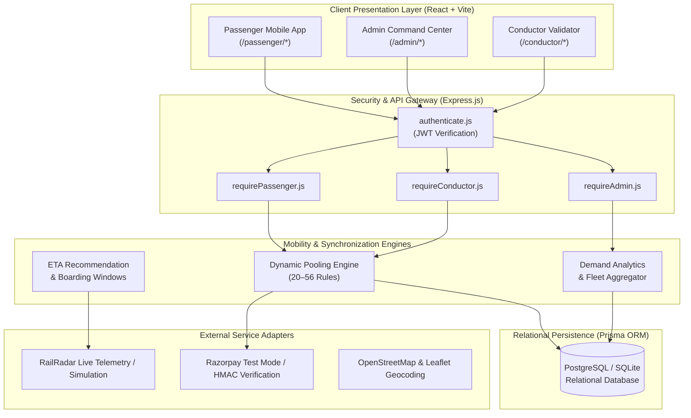
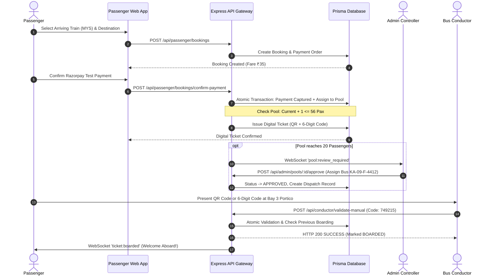

# RAILBUS — System Architecture & Topology

## 1. High-Level System Architecture

```mermaid
flowchart TD
    subgraph ClientLayer ["Client Presentation Layer (React + Vite)"]
        PA["Passenger Mobile App<br/>(/passenger/*)"]
        ACC["Admin Command Center<br/>(/admin/*)"]
        CA["Conductor Validator<br/>(/conductor/*)"]
    end

    subgraph SecurityBoundary ["Security & API Gateway (Express.js)"]
        MW_AUTH["authenticate.js<br/>(JWT Verification)"]
        MW_PASS["requirePassenger.js"]
        MW_ADMIN["requireAdmin.js"]
        MW_COND["requireConductor.js"]
    end

    subgraph CoreEngine ["Mobility & Synchronization Engines"]
        POOL_ENG["Dynamic Pooling Engine<br/>(20–56 Rules)"]
        ETA_ENG["ETA Recommendation<br/>& Boarding Windows"]
        DEMAND_ENG["Demand Analytics<br/>& Fleet Aggregator"]
    end

    subgraph Integrations ["External Service Adapters"]
        RR["RailRadar Live Telemetry / Simulation"]
        RZP["Razorpay Test Mode / HMAC Verification"]
        OSM["OpenStreetMap & Leaflet Geocoding"]
    end

    subgraph DataStore ["Relational Persistence (Prisma ORM)"]
        DB[("PostgreSQL / SQLite<br/>Relational Database")]
    end

    PA --> MW_AUTH --> MW_PASS --> POOL_ENG
    ACC --> MW_AUTH --> MW_ADMIN --> DEMAND_ENG
    CA --> MW_AUTH --> MW_COND --> POOL_ENG

    POOL_ENG --> DB
    DEMAND_ENG --> DB
    ETA_ENG --> RR
    POOL_ENG --> RZP
```

---

## 2. End-to-End Passenger-to-Boarding Lifecycle

```mermaid
sequenceDiagram
    autonumber
    actor P as Passenger
    participant App as Passenger Web App
    participant API as Express API Gateway
    participant DB as Prisma Database
    actor A as Admin Controller
    actor C as Bus Conductor

    P->>App: Select Arriving Train (MYS) & Destination
    App->>API: POST /api/passenger/bookings
    API->>DB: Create Booking & Payment Order
    DB-->>App: Booking Created (Fare ₹35)

    P->>App: Confirm Razorpay Test Payment
    App->>API: POST /api/passenger/bookings/confirm-payment
    API->>DB: Atomic Transaction: Payment Captured + Assign to Pool
    Note over API,DB: Check Pool: Current + 1 <= 56 Pax
    API->>DB: Issue Digital Ticket (QR + 6-Digit Code)
    DB-->>App: Digital Ticket Confirmed

    opt Pool reaches 20 Passengers
        API->>A: WebSocket 'pool:review_required'
        A->>API: POST /api/admin/pools/:id/approve (Assign Bus KA-09-F-4412)
        API->>DB: Status -> APPROVED, Create Dispatch Record
    end

    P->>C: Present QR Code or 6-Digit Code at Bay 3 Portico
    C->>API: POST /api/conductor/validate-manual (Code: 749215)
    API->>DB: Atomic Validation & Check Previous Boarding
    API-->>C: HTTP 200 SUCCESS (Marked BOARDED)
    API->>P: WebSocket 'ticket:boarded' (Welcome Aboard!)
```
